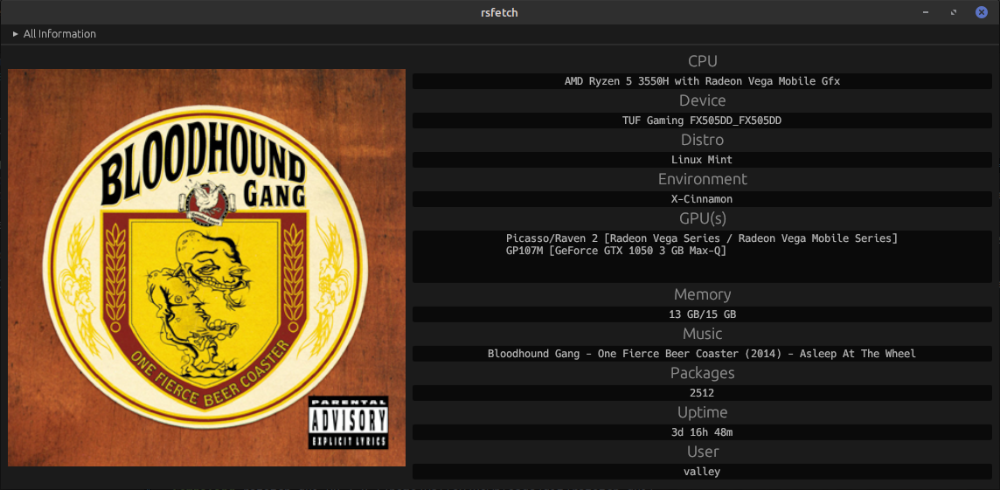

# rsfetch-gui

CLI Args:
- The first one is the package manager to be passed for package counting.
- The second one is the path to an image to display along with the information.

Features:
- `music_mpd`: for getting music info from mpd
- `music_playerctl`: for getting music info from playerctl-supported player

Screenshots:

`$ cargo run --features=music_mpd -- dpkg /tmp/cover.png`

[]
